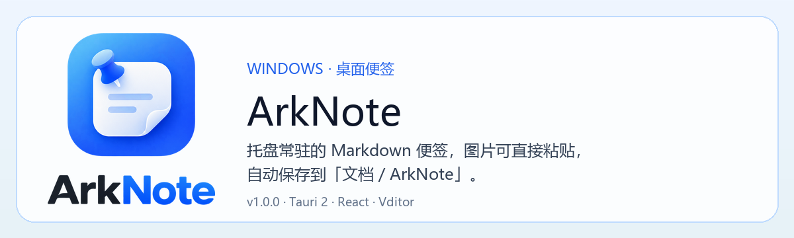
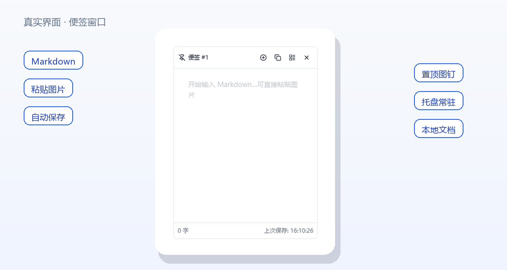
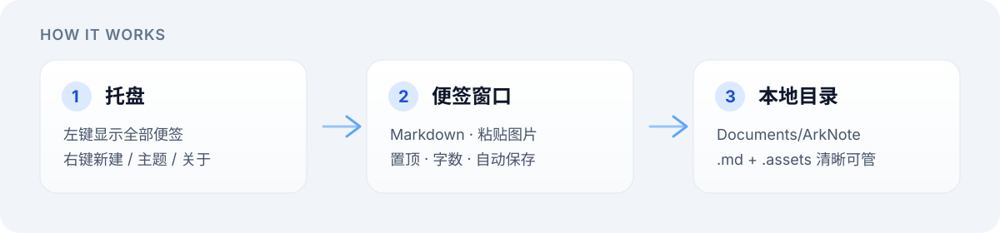

<p align="center">
  
</p>

<p align="center">
  <a href="https://github.com/xiaoyangtx996/ArkNote"></a>
  
  
</p>

**ArkNote** 是一款托盘常驻的 Windows 桌面便签：每张便签一个原生窗口，支持 Markdown 与直接粘贴图片，内容自动写入「文档 / ArkNote」。

<p align="center">
  
</p>

## 它能做什么

- **托盘常驻** — 左键显示全部便签，右键新建、切换主题、打开关于页
- **独立窗口** — 透明背景，只露出便签本体；可置顶、新建、从列表管理
- **Markdown + 图片** — Vditor IR 编辑；粘贴图片按 Typora 风格落到 `note-{id}.assets/`
- **自动保存** — 正文写入 `note-{id}.md`，窗口几何与主题记在 `index.json`
- **本地可管** — 从列表删除便签时，同步清理对应 `.md` 与资源目录

<p align="center">
  
</p>

## 快速开始

### 安装包

构建产物：

```text
src-tauri/target/release/bundle/nsis/ArkNote_1.0.1_x64-setup.exe
```

安装后从开始菜单或托盘启动。

### 开发运行

```bash
npm install
npm run tauri:dev
```

仅预览前端（数据走 localStorage，不落盘图片）：

```bash
npm run dev
```

### 打包

```bash
npm run tauri:build
```

## 怎么用

| 操作 | 说明 |
| --- | --- |
| 托盘左键 | 显示所有便签窗口 |
| 托盘右键 | 显示便签 / 新建 / 颜色主题 / 关于 / 退出 |
| `Ctrl+N` | 新建便签 |
| 便签标题栏 | 置顶、新建、列表、关闭 |
| 编辑区 | Markdown 输入，可直接粘贴图片 |

## 数据目录

正式路径在用户「文档」下：

```text
Documents/ArkNote/
  index.json          # 窗口状态与索引
  note-{id}.md        # 便签正文（自动保存）
  note-{id}.assets/   # 图片资源（相对路径引用）
```

## 技术栈

- **壳**：Tauri 2（托盘、多窗口、本地文件）
- **界面**：React + Vite + Tailwind
- **编辑器**：Vditor IR

| 模式 | 命令 | 数据 |
| --- | --- | --- |
| 桌面 | `npm run tauri:dev` / 安装包 | `Documents/ArkNote` |
| 浏览器预览 | `npm run dev` | localStorage |

## 链接

- GitHub：https://github.com/xiaoyangtx996/ArkNote
- 关于页内也可打开同一仓库地址
